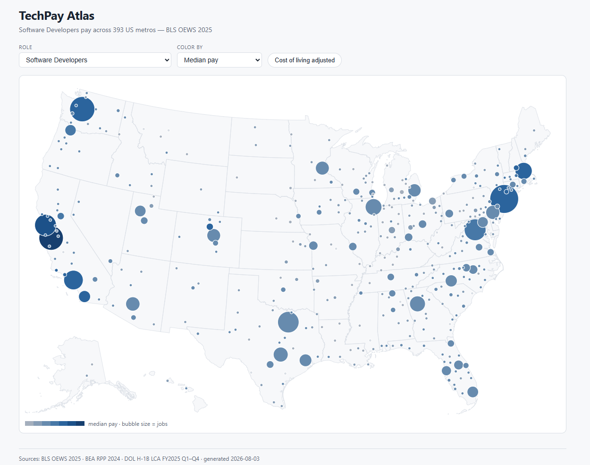
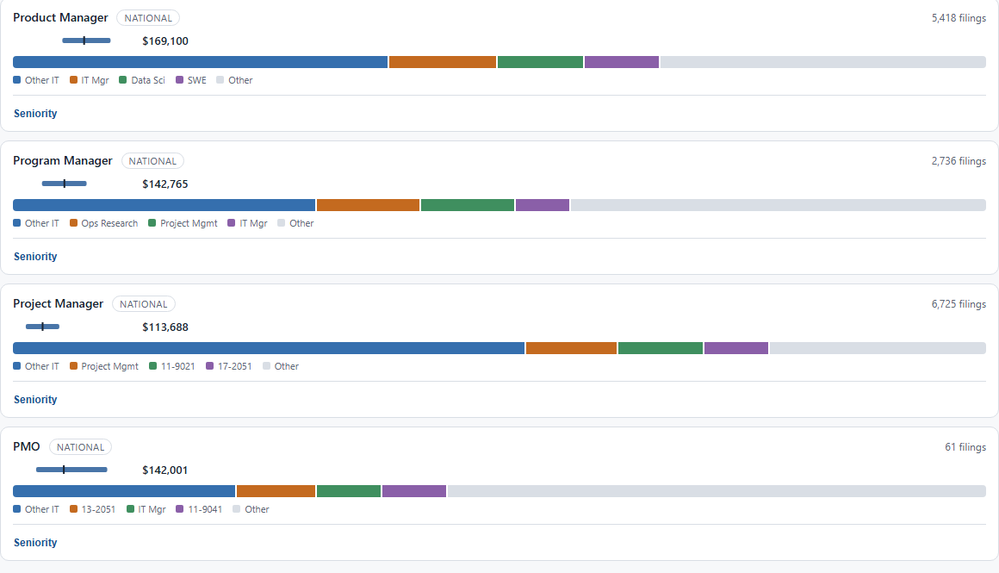

# TechPay Atlas

**Live site: https://rosstheboss90.github.io/techpay-atlas/**

What US tech jobs actually pay — across 393 metros, 21 roles, and the real job titles
the official statistics erase. Built entirely on public government data.



## What it shows

- **Metro salary map** — median pay for a chosen role across every US metro, bubble size =
  employment. One toggle re-expresses everything in cost-of-living-adjusted dollars
  (BEA Regional Price Parities), which reorders the map more than people expect.
- **Metro drill-down** — full wage percentile bands (p10–p90) per role, plus what specific
  employers actually paid H-1B hires in that metro (from mandatory DOL disclosure filings).
- **Title lens** — the part official data can't do. BLS collapses "Technical Program Manager"
  ($173k median) and "Technical Project Manager" ($114k) into the same catch-all occupation
  code. Using ~542k raw H-1B filings, this section reports pay by *real job title* —
  4 title families, seniority ladders (base → senior → staff/principal → lead → director),
  and a conflation bar showing exactly which official codes each title gets scattered into.



## Data sources

| Source | What it provides | Vintage |
|---|---|---|
| [BLS OEWS](https://www.bls.gov/oes/) | Wage percentiles by occupation × metro | May 2025 |
| [DOL H-1B LCA disclosures](https://www.dol.gov/agencies/eta/foreign-labor/performance) | Employer-level filings: title, wage, worksite | FY2025 Q1–Q4 |
| [BEA Regional Price Parities](https://www.bea.gov/data/prices-inflation/regional-price-parities-state-and-metro-area) | Metro cost-of-living index | 2024 |
| [HUD ZIP–CBSA crosswalk](https://www.huduser.gov/portal/datasets/usps_crosswalk.html) | Worksite ZIP → metro assignment | 2026 Q1 |
| Census Gazetteer | Metro coordinates | 2025 |

## How it's built

An offline TypeScript pipeline (`pipeline/`) parses the raw government files (streaming
readers — the LCA workbooks are large enough to break most xlsx libraries), validates them
against ~10 data-quality tripwires, and emits compact JSON committed under
`site/public/data/`. The site (`site/`) is a Next.js static export with D3 — no backend,
no tracking, nothing to run. Raw inputs are not committed; refresh with `npm run download`
(plus one manual HUD download) and `npm run pipeline`.

Honesty rules are part of the design: suppressed cells stay suppressed, small samples are
labeled instead of hidden, H-1B wage floors given as ranges are midpointed and say so, and
every number cites its source vintage in the footer.

```
pipeline/   # parsers, aggregation, emit — 145 tests
site/       # Next.js static export — component tests + Playwright e2e
data/raw/   # gitignored government source files
```

### Run locally

```bash
cd site && npm ci && npm run dev   # http://localhost:3020
```

## Caveats worth knowing

- H-1B filings skew toward large employers and sponsored roles; they are evidence of what
  those employers pay, not a random sample of the market.
- 13-1082 (Project Management Specialists) is an all-industry series — tech-only PM pay
  can't be isolated from OEWS.
- Six Puerto Rico metros have salary data but no map position (the Albers USA projection
  omits PR) and no RPP adjustment.
